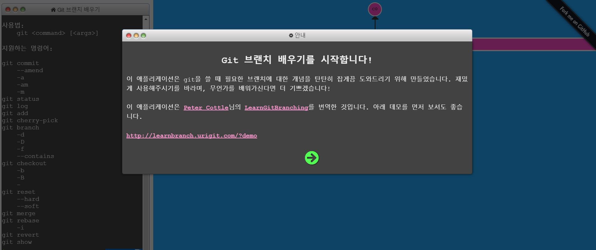

# 프로그래머에게 도움되는  사이트 모음
> 평소 모아논 좋은 사이트, 자료들을 정리해서 공유합니다.
> 각 사이트의 이름을 클릭하면 해당 링크로 넘어갑니다.
> 더 좋은사이트를 많이 알고계신분은 언제든지 알려주세요 

[TOC]

# 1. 종합

* ###1.1 [생활코딩](https://opentutorials.org/course/1)
		설명 : 웹프로그래밍 및 다양한 자료와 강의가 있는 사이트.
     

* ###1.2 [좋은사람들](https://github.com/stunstunstun/awesome-wik)
		설명 : 위키 페이지를 통해서 문서에 대한 일관성을 유지하고 꾸준히 지속적으로 리마인드 하기 위해 만든 페이지
              주니어 엔지니어에게 좋은 자료들이 많이 있다.
  

* ###1.3 [인프런](https://www.inflearn.com/)
		설명 : 다양한 분야의 강좌들을 모아논 사이트 다양한 분야의 질좋은 (무료,유료)강좌들이 올라와 있다.
   

* ###1.4 [어쩌넷](http://www.eojji.net/drive/coding-everybody-programming)
		설명 : 다양한 기술을 배울 수있는 사이트들이 정리되어 있다.

# 2. 프로그래밍
* ###2.1 [K-MOOC: 데이터 과학을 위한 파이썬 입문](https://github.com/TeamLab/Gachon_CS50_Python_KMOOC)
		설명 : 데이터 과학을 위한 파이썬 입문 강좌

# 3. 웹프로그래밍
* ###3.1 [w3school](https://www.w3schools.com/)
		설명 : 웹프로그래밍에 관한 전반을 배울 수 있으며 다양한 예제들이 많이 있다.
        	  홈페이지 내에서 직접 예제를 수정해 볼 수 있는것도 큰 장점이다.
  

* ###3.2 [PoiemaWeb](http://poiemaweb.com/)
 		설명 : js, jquery등 웹에 대해 심도있고 자세하게 정리되어 있다.

# 4. 딥러닝
* ###4.1 [김성훈 교수님의 모두의 딥러닝](https://www.youtube.com/watch?v=BS6O0zOGX4E&list=PLlMkM4tgfjnLSOjrEJN31gZATbcj_MpUm)
	 	설명 : 딥러닝 기초를 정말 이해하기 쉽게 설명해주신다.

* ###4.2 [김성훈 교수님의 모두의 딥러닝2](http://hunkim.github.io/ml/)
	 	설명 : 위 강좌 바로 다음 강좌

* ###4.3 [책 읽어주는 딥러닝](https://www.slideshare.net/carpedm20/deview-2017-80824162?refer=%EA%B0%9C%EB%B0%9C%EC%9E%90%EC%8A%A4%EB%9F%BD%EB%8B%A4)
		설명 : 딥러닝으로 구현한 프로젝트 진짜 신기하다.

# 5. 문제풀이 사이트
* ###5.1 [프로그래머스](https://programmers.co.kr/)
		설명 : 다양한 강좌와 문제풀이, 또 직접 문제를 풀수도 있는 사이트

* ###5.2 [백준](https://www.acmicpc.net/)
		설명 : 따로 설명이 필요없는 너무나 유명한 사이트

* ###5.3 [SW Expert Academy](https://swexpertacademy.com/main/main.do)
		설명 : 삼성전자에서 올 여름에 출시한 온라인 알고리즘 코딩 사이트.

* ###5.4 [codeGround](https://www.codeground.org/)
		설명 : 삼성에서 만든 프로그래밍 경진대회 사이트.
			  삼성전자 S/W Test를 신청해서 볼 수 있는데, A,B형 모두 합격하면, 공채에서 가점을 준다고 한다.

# 6. 수학
* ###6.1 [칸아카데미](https://www.khanacademy.org/)
		설명 : 대학수학에 필요한 전반적이 내용을 볼 수 있다. 수학뿐만아니라 다양한 분야를 배울 수 있으며,
               영문사이트로 들어가면 더욱 다양한 분야의 강좌를 만날 수 있다.

* ###6.2 [수학방](http://mathbang.net/)
	 	설명 : 고등과정까지의 수학을 잘 설명한 사이트

* ###선형대수
 	* ####[3Blue1Brown](https://www.youtube.com/watch?v=kjBOesZCoqc&list=PLZHQObOWTQDPD3MizzM2xVFitgF8hE_ab&index=1)
			설명 : 수학을 시각화시켜 이해하기 쉽게 표현했다. 수학에 관한 여러 자료가있는 유튜브 사이트.

 * ####[이상화교수님의 선형대수](https://www.youtube.com/playlist?list=PLSN_PltQeOyjDGSghAf92VhdMBeaLZWR3)
            설명 : 한양대에서도 명강의로 꼽히는 강의라고 한다.

# 7. 컴퓨터 이론
* ###7.1 [권오흠교수님의 자바로배우는 알고리즘](http://alg.pknu.ac.kr/t/2017-1/360)
		설명 : 알고리즘에 대해 훌륭한 강의

* ###7.2 [알고리즘 시각화 사이트](http://algo-visualizer.jasonpark.me/#path=backtracking/knight%27s_tour/basic)
		설명 : 알고리즘을 시각화 해논 사이트로 알고리즘을 이해하는데 도움이 된다.

* ###7.3 [반효경교수님의 운영체제 강의](http://www.kocw.net/home/search/kemView.do?kemId=1046323)
		설명 : 이화여대 반효경교수님의 운영체제 강의

# 기타
* ###온라인 IDE
* ###Git
  * ####[learnbranch](http://learnbranch.urigit.com/)
  		설명 : 깃 브랜치를 배우는 사이트, 깃 흐름을 공부하는데 많은 도움이 된다.

* ###리눅스
  * ####[Linux Journey](https://linuxjourney.com/)
  		설명 : 리눅스를 무료로 연습하고, 배울 수 있는 사이트

* ###템플릿
  * ####[코드펜](https://codepen.io/)
  		설명 : JS로 만든 다양한 작품들을 만나볼 수 있는 사이트

* ###색조합 사이트
* ####[색조합 사이트 모음](https://pf.kakao.com/_Mfaxgd/2675868)
  		설명 : 색조합 사이트 모음

* ###서적자료
  * ####[TheBook](https://thebook.io/)
  		설명 : 각종 IT관련 서적을 볼 수 있다. 일부분만 보여주는 책들도 있지만 전부 다 볼수있는 책들도 많다.

  * ####[packtpub](https://www.packtpub.com/packt/offers/free-learning)
  		설명 : 프로그래밍 관련 EBook이 매일 하나씩 무료로 올라오는 사이트, 원서 주의!

* ###슬라이드 자료
  * ####[슬라이드쉐어](https://www.slideshare.net/)
		설명 : 없는걸 찾는게 더 힘들정도로 거의 모든 주제의 슬라이드가 올라와 있는 사이트

* ### 구직 정보
 * ####[주니어 개발자를 위한 취업 정보](https://github.com/jojoldu/junior-recruit-scheduler/blob/master/README.md)
		설명 : 주니어 개발자를 위한 다양한 취업정보가 지속적으로 업데이트 되는 자료.

